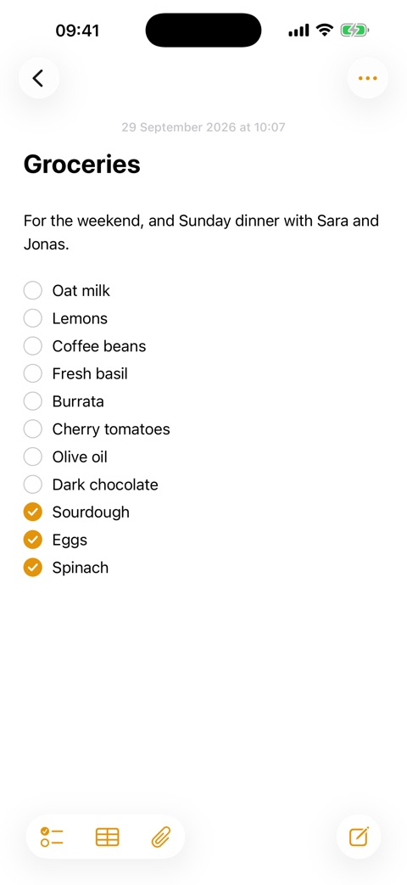
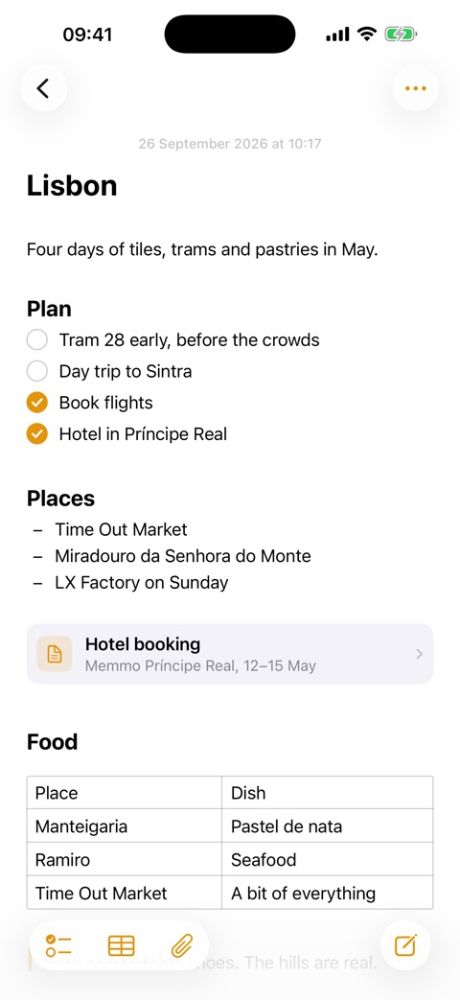
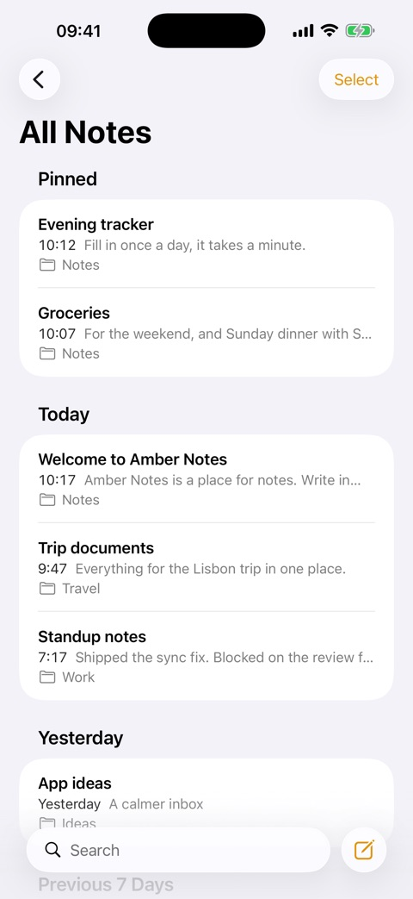

# Amber Notes

Apple Notes clone with MCP support, Markdown support, and more.

The notes app your AI can actually use: as simple as Apple Notes, and ChatGPT, Claude, Claude Code and Codex can read and edit it through MCP, with your approval.

[Download for Mac](https://amber-notes.vercel.app/download) · App Store (coming soon) · [Website](https://amber-notes.vercel.app)

<p align="center">
  
  
  
</p>

## What it does

- **Apple Notes layout and behaviour.** Folders, a note list grouped by date, pinning, search, multi-select, Recently Deleted. When in doubt, it does what Notes does.
- **Markdown underneath, formatted on screen.** Headings, bold, italic, underline, strikethrough, code, quotes, links. The markdown syntax stays out of sight.
- **Lists like Notes.** Checklists (ticked items slide to the bottom), bulleted (`*`), dashed (`-`) and numbered lists. Return continues a list, Tab nests it.
- **Tables** you edit cell by cell, including typed columns (number, date, yes/no).
- **Sub-notes.** Link a note inside another, like a folder inside a page.
- **Files and images** inside a note: paste, drag in, or attach. PDFs open in Quick Look.
- **Live sync.** Typing on one device shows up on the others in about half a second. Edits made on two devices at once are never silently lost.
- **Share a note as a web page** with a private link, and stop sharing at any time.
- **AI access over MCP.** Connect ChatGPT, Claude, Claude Code or Codex. You approve every connection inside the app and pick read-only or read-and-edit. Every change an assistant makes keeps the previous version.
- **Apple Notes import** on the Mac, and a menu bar item for quick capture.
- **Private by default.** Sign in with Apple or email. No ads, no analytics, no tracking. Delete your account from Settings.

## How it's built

| Part | Where | What |
|---|---|---|
| App | `Pane/` | SwiftUI for iOS 26 and macOS 26. The editor is TextKit 2 with its own layout fragments for checkboxes, bullets, tables and embeds. SwiftData holds a local copy of everything. |
| Sync | `Pane/Sync/` | Pushes and pulls through Supabase with version checks, and listens on Supabase Realtime for changes from other devices. |
| Backend | `supabase/` | Postgres with row-level security on every table, per-account limits and rate limits in the database, Storage for files, and Edge Functions. |
| AI server | `supabase/functions/mcp/` | An MCP server (Streamable HTTP) with 27 tools. Web clients connect with OAuth 2.1 (PKCE, dynamic client registration) and approve inside the app. Claude Code and Codex use a revocable header token. Every call runs as the note owner with row-level security. |
| Share site | `web/` | Next.js. Renders shared notes safely (sanitized markdown, strict CSP), with a report link and a privacy page. |
| Share extension | `PaneShare/` | Share sheet target on iOS. |

The Xcode project is generated from `project.yml` with [XcodeGen](https://github.com/yonaskolb/XcodeGen). Folder and target names still say "Pane", the app's working name.

## Build from source

You need macOS 26 with Xcode 26, Homebrew, and Docker (for the local Supabase stack). A fresh clone runs entirely on your machine.

```sh
brew install xcodegen supabase/tap/supabase deno pnpm

git clone https://github.com/emilwagman/amber-notes.git
cd amber-notes
supabase start            # local Postgres, Auth, Storage and Functions on ports 56420–56429
xcodegen generate
open Pane.xcodeproj       # run the "Pane" scheme on "My Mac" or an iPhone simulator
```

The app talks to the local stack through `Config/Backend.xcconfig`, which carries Supabase's standard local-only development key. To point your builds at a real project, create `Config/Backend.local.xcconfig` (gitignored) with your own `PANE_SUPABASE_URL`, `PANE_SUPABASE_KEY` and `PANE_SHARE_URL`.

Running on a physical device needs your own Apple team. Change `DEVELOPMENT_TEAM` in `project.yml`, and the bundle ids if you like.

### Tests

```sh
scripts/qa-test.sh                                   # Mac unit and interaction tests
deno test --allow-all supabase/functions/mcp/notes.test.ts
scripts/mcp-e2e.sh                                   # MCP end-to-end, against the local stack
scripts/share-e2e.sh                                 # share links end-to-end, against the local stack
(cd web && pnpm install && pnpm test && pnpm build)  # share site
```

The interaction tests drive the real editor in an offscreen window, so they never move your mouse or take focus.

## Run your own backend

Everything the app needs runs on one Supabase project:

1. Create a project at [supabase.com](https://supabase.com) and put a personal access token in `.env` as `SUPABASE_ACCESS_TOKEN=sbp_…`.
2. Run `scripts/deploy-backend.sh <project-ref>`. It links the project, applies the migrations, deploys the functions, pushes the auth settings, and writes `Config/Backend.local.xcconfig`.
3. For share links, deploy `web/` to any Next.js host and set `PANE_SHARE_URL` to it.

## Connect an AI

In the app, open **Settings → Connect an AI** and follow the steps for your client. ChatGPT and Claude get a plain server address and ask Amber Notes for permission through OAuth. Claude Code and Codex get a command with a revocable token. Connections are listed in Settings, where you can disconnect each one.

## Privacy and security

- Your notes are readable only by your account: row-level security applies to the app, the AI server and direct API calls alike.
- AI tokens are stored as hashes and can be read-only.
- Shared pages are public to anyone with the link. The app warns before creating one, and a page stops working the moment you stop sharing.
- [Privacy policy](https://amber-notes.vercel.app/privacy) · [Security policy](SECURITY.md)

## License

[MIT](LICENSE). Made by Emil Wagman.
