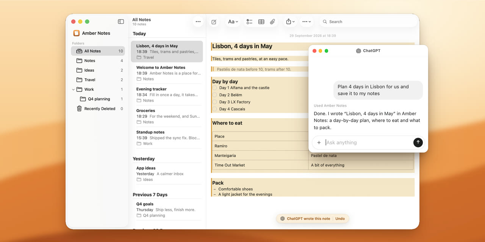
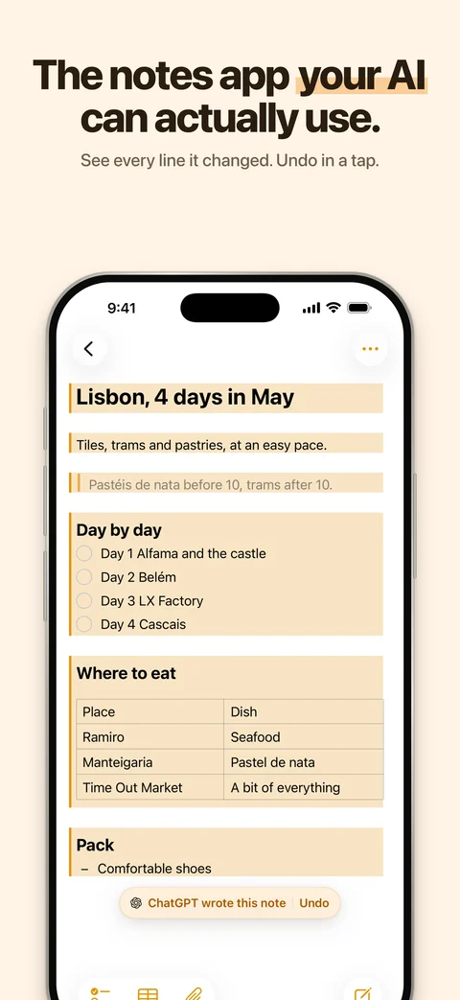
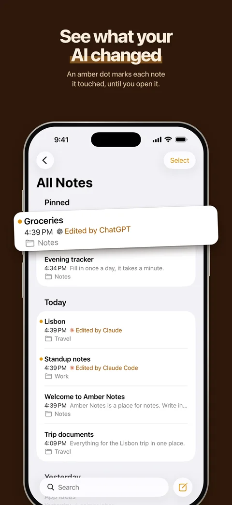
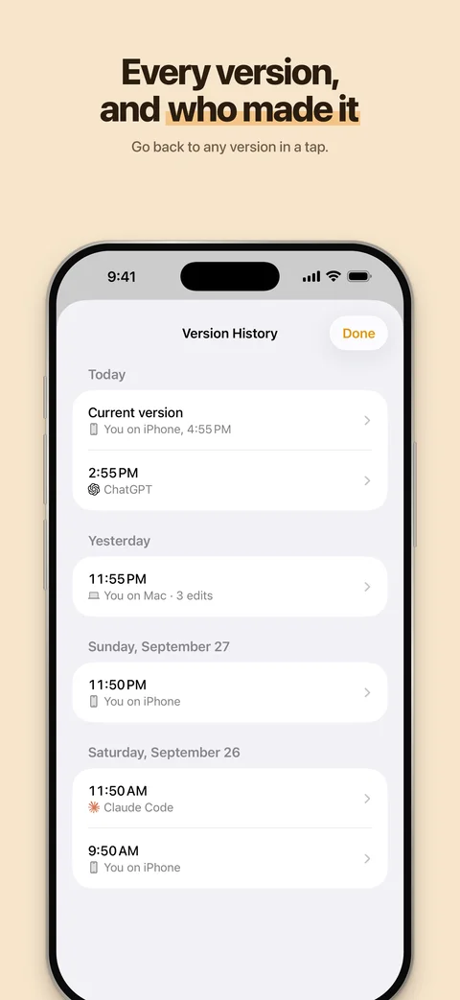

<p align="center">
  
</p>

<h1 align="center">Pinto Notes</h1>

<p align="center">
  The notes app your AI can actually use. Apple Notes-style notes for iPhone and Mac that ChatGPT, Claude, Claude Code and Codex can read and edit.
  Formerly Amber Notes.
</p>

<p align="center">
  <a href="https://pintonotes.com/download"><b>Download for Mac</b></a>
  &nbsp;·&nbsp; iPhone app in App Store review
  &nbsp;·&nbsp; <a href="https://pintonotes.com">pintonotes.com</a>
</p>

<p align="center">
  
</p>

<table align="center">
  <tr>
    <td></td>
    <td></td>
    <td></td>
  </tr>
</table>

## What it does

- **AI edits you can see and undo.** Whatever an assistant writes is tinted and labeled with its name, and one tap undoes it.
- **Version history.** Every change keeps the previous version, with who made it: you on iPhone, you on Mac, or which AI.
- **Apple Notes import** on the Mac, and **Evernote** (.enex), **Google Keep** (Takeout) and **Markdown or text** imports on the Mac and iPhone, bring your notes over.
- **Sync between iPhone and Mac** in about half a second.
- **Connect ChatGPT, Claude, Claude Code or Codex.** You approve each connection in the app and choose read-only or read-and-edit.

## Features in detail

- **Apple Notes layout and behaviour.** Folders, a note list grouped by date, pinning, search, multi-select, Recently Deleted. When in doubt, it does what Notes does.
- **Markdown underneath, formatted on screen.** Headings, bold, italic, underline, strikethrough, code, quotes, links. The markdown syntax stays out of sight.
- **Lists like Notes.** Checklists (ticked items slide to the bottom), bulleted (`*`), dashed (`-`) and numbered lists. Return continues a list, Tab nests it.
- **Tables** you edit cell by cell, including typed columns (number, date, yes/no).
- **Sub-notes.** Link a note inside another, like a folder inside a page.
- **Files and images** inside a note: paste, drag in, or attach. PDFs open in Quick Look.
- **Live sync.** Typing on one device shows up on the others in about half a second. Edits made on two devices at once are never silently lost.
- **Share a note as a web page** with a private link, and stop sharing at any time.
- **AI access over MCP.** Connect ChatGPT, Claude, Claude Code or Codex. You approve every connection inside the app and pick read-only or read-and-edit. Every change an assistant makes keeps the previous version.
- **Apple Notes import** on the Mac, and a menu bar item for quick capture.
- **Evernote import.** Each exported notebook (.enex) becomes a folder, with checklists, tables, images, PDFs, dates and tags kept. Importing the same export again skips what's already here.
- **Google Keep import.** From a Google Takeout download: text and checklists, labels as folders or tags, pins, dates and images. Archived notes come only if you ask, into an Archive folder.
- **Markdown or text import.** A folder or .zip from Obsidian, Notion, Bear, Joplin, Logseq, Simplenote or Standard Notes: subfolders become folders, linked images and files come along, front-matter dates and tags are kept, and wiki links become plain titles.
- **Private by default.** Sign in with Apple or email. No ads, no analytics or tracking in the app; the website counts visits without cookies. Delete your account from Settings.

## How it's built

| Part | Where | What |
|---|---|---|
| App | `Pane/` | SwiftUI for iOS 26 and macOS 26. The editor is TextKit 2 with its own layout fragments for checkboxes, bullets, tables and embeds. SwiftData holds a local copy of everything. |
| Sync | `Pane/Sync/` | Pushes and pulls through Supabase with version checks, and listens on Supabase Realtime for changes from other devices. |
| Backend | `supabase/` | Postgres with row-level security on every table, per-account limits and rate limits in the database, Storage for files, and Edge Functions. |
| AI server | `supabase/functions/mcp/` | An MCP server (Streamable HTTP) with 27 tools. Public address `https://mcp.ambernotes.app` (proxied by the site, `web/middleware.ts`). Web clients connect with OAuth 2.1 (PKCE, dynamic client registration) and approve in the app or on the web at `ambernotes.app/connect`. Claude Code and Codex use a revocable header token. Every call runs as the note owner with row-level security. |
| Share site | `web/` | Next.js. Renders shared notes safely (sanitized markdown, strict CSP), with a report link and a privacy page. |
| Share extension | `PaneShare/` | Share sheet target on iOS. |

The Xcode project is generated from `project.yml` with [XcodeGen](https://github.com/yonaskolb/XcodeGen). Folder and target names still say "Pane", the app's working name.

## Build from source

You need macOS 26 with Xcode 26, Homebrew, and Docker (for the local Supabase stack). A fresh clone runs entirely on your machine.

```sh
brew install xcodegen supabase/tap/supabase deno pnpm

git clone https://github.com/pinto-notes/pinto-notes.git
cd pinto-notes
supabase start            # local Postgres, Auth, Storage and Functions on ports 56420–56429
xcodegen generate
open Pane.xcodeproj       # run the "Pane" scheme on "My Mac" or an iPhone simulator
```

The app talks to the local stack through `Config/Backend.xcconfig`, which carries Supabase's standard local-only development key. To point your builds at a real project, create `Config/Backend.local.xcconfig` (gitignored) with your own `PANE_SUPABASE_URL`, `PANE_SUPABASE_KEY` and `PANE_SHARE_URL`.

Running on a physical device needs your own Apple team. Change `DEVELOPMENT_TEAM` in `project.yml`, and the bundle ids if you like.

### Tests

```sh
scripts/qa-test.sh                                   # Mac unit and interaction tests
deno test --allow-all supabase/functions/mcp/notes.test.ts
scripts/mcp-e2e.sh                                   # MCP end-to-end, against the local stack
scripts/share-e2e.sh                                 # share links end-to-end, against the local stack
(cd web && pnpm install && pnpm test && pnpm build)  # share site
```

The interaction tests drive the real editor in an offscreen window, so they never move your mouse or take focus.

## Run your own backend

Everything the app needs runs on one Supabase project:

1. Create a project at [supabase.com](https://supabase.com) and put a personal access token in `.env` as `SUPABASE_ACCESS_TOKEN=sbp_…`.
2. Run `scripts/deploy-backend.sh <project-ref>`. It links the project, applies the migrations, deploys the functions, pushes the auth settings, and writes `Config/Backend.local.xcconfig`.
3. For share links, deploy `web/` to any Next.js host and set `PANE_SHARE_URL` to it.

## Connect an AI

In the app, open **Settings → Connect an AI** and follow the steps for your client. ChatGPT and Claude get a plain server address, `https://mcp.ambernotes.app`, and ask Pinto Notes for permission through OAuth: a page on pintonotes.com opens, where you answer in the app or sign in and answer on the web. Claude Code and Codex get a command with a revocable token. Connections are listed in Settings, where you can disconnect each one.

## Privacy and security

- **End-to-end encryption.** Each account has one random 256-bit key, made on your first device and kept as a synced Keychain item, so iCloud Keychain carries it to your other iPhone or Mac. Note bodies, titles, folder names, files and old versions are sealed with AES-256-GCM before upload. The server holds no key.
- **AI connections.** When you approve an AI, the app wraps your key under the OAuth authorization code; at the token exchange it is rewrapped under the access and refresh tokens, and the server keeps only token hashes. Disconnecting deletes the wrap.
- **The honest limit.** During an AI request the server decrypts the notes that request needs, in memory. Notes you lock with the notes password stay out of reach, because that key isn't on the server. Dates, sizes, folder structure and which notes are locked stay readable. If you lose every device, have iCloud Keychain off and never saved the recovery key, nobody can open the notes.
- The full design: [docs/Technical/e2ee-design.md](docs/Technical/e2ee-design.md).
- Row-level security applies to the app, the AI server and direct API calls alike, on top of the encryption.
- AI tokens are stored as hashes and can be read-only.
- Shared pages are public to anyone with the link. The app warns before creating one, and a page stops working the moment you stop sharing.
- [Privacy policy](https://pintonotes.com/privacy) · [Security policy](SECURITY.md)

## Thanks

Everyone who has had a pull request merged, in the order they joined:

- [@wufangyong973](https://github.com/wufangyong973): brought the website's README up to date ([#97](https://github.com/pinto-notes/pinto-notes/pull/97))
- [@arnavtambe](https://github.com/arnavtambe): removed an unused field from the app's connections ([#109](https://github.com/pinto-notes/pinto-notes/pull/109))
- [@sameer-dhande](https://github.com/sameer-dhande): made each help answer announce its own question to screen readers ([#170](https://github.com/pinto-notes/pinto-notes/pull/170)) and named the table's row and column handles for VoiceOver ([#176](https://github.com/pinto-notes/pinto-notes/pull/176))

Want to be next? [CONTRIBUTING.md](CONTRIBUTING.md) has where to start, and ideas of your own are welcome in [Discussions](https://github.com/pinto-notes/pinto-notes/discussions/categories/ideas).

## License

[MIT](LICENSE). Made by Emil Wagman at [Incredible](https://incredible.one).
